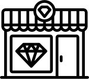

	<h3>Retail Clients &amp; Wholesale Prices?</h3>
	
As a retail client you won't be able to purchase directly form us&mdash;but fret not! You can still save big with us. Read on to learn how to get your diamonds at affordable prices today and forever.

	
	

		<h5>Making of Custom Jewelery</h5>
		
	
			Having a custom-made piece of jewelery tailor-made for you is an incredibly exciting process with a highly rewarding result&mdash;a luxurious piece of jewelery that was made exclusively for you.
		

		

			At this time, we offer custom collections only for businesses that buy in bulk. As a retail customer one of your local jewelers or goldsmiths will be happy to offer on-site service and advice you on your special journey. 
		

		

			You profit directly from our wholesale diamond prices, and you support your local jeweler who gets your business and acts as a middlemen in the diamond transaction. <a href="/contact">Get in touch today.</a>
		

	

	

		

			

			

			

				
			

			

				
			

			

				
			

		

		

		1
		
Choose the diamonds of your dreams from us. We deliver directly to your jeweler...

		

		2
		
...who then crafts your personal piece of jewelery.

		

		3
		
You are happy because you saved big and support your local jeweler. 

		

	

	

	

	

	

		<h5>Buying Loose Certified Diamonds</h5>
		
	
			Retail clients can wish to buy GIA-certified loose diamonds for other purposes than setting them in jewelery. Wealth consolidation, investment, or as a collector's item are only a few possible reasons.
		

		

			As provider of excellent diamonds below wholesale market prices we can supply exceptional diamonds from 0.5 up to 100 carats. We can assist hard-asset portfolio managers and family offices in wealth consolidation starting from low five figure amounts up to eight figure amounts.
		

		

			If you are looking for exceptional diamonds and exceptional service, please <a href="/contact">contact us today</a>.
		

	

	

	<h2 class="cta-head">Don't miss this opportunity!</h2>
	
Start getting superb diamonds inexpensively today

<a class="cta-btn to-cta" href="#">Get a Custom Quote</a>

